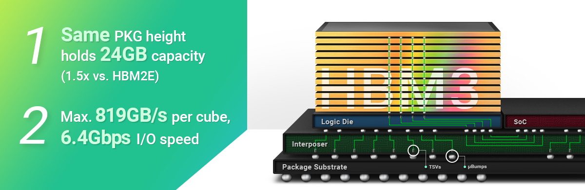
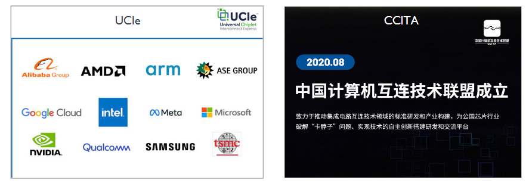

<!--Copyright © ZOMI 适用于[License](https://github.com/Infrasys-AI/AIInfra)版权许可-->

# 06.AI 芯片内互联技术

Author by: 陈彦伯

本节在前文的基础上继续向底层发展，聚焦 AI 集群之间的互联技术。本文将从大模型训推系统的通信需求出发，引入相关硬件的核心概念，并逐步拆解 AI 集群互联技术发展的核心逻辑。

## 大模型训推系统的通信需求

如果将 AlexNet 在 ImageNet 分类任务上崭露头角视作这一轮人工智能发展的起点，那么到目前位置这种发展大致可以分为下表中所总结的三个阶段。

| 发展阶段  | 标志性模型 & 算法 | 主要并行方式 | 参数规模  | 主流互联方案                      |
| ----- | ------------------- | -------------------- | -------- | --------------------------- |
| **视觉时代**（2012~2018） | AlexNet, ResNet | DP  | ~10M  | PCIe + 以太网      |
| **推荐时代**（2015~2020）  | Wide&Deep, NCF | EP + DP | ~1B    | 部分引入 IB（InfiniBand） |
| **大模型时代**（2017~至今） | Transformer, GPT | 3D 并行 | ~100B | Chiplet 互联、RDMA 架构、专用交换芯片等   |

不难看出人工智能发展的一个趋势就是：随着模型参数量越来越大，模型的并行方式变得愈发复杂，对通信的要求也变得更高，主流的互联方案也随之升级。具体来说，人工智能技术的通信需求主要发生了以下两点变化：

1. **频率变快**：随着大模型规模的扩大，单机单卡已无法承载完整的训推任务。由TP、PP与DP组成3D并行策略（注：MoE架构的模型，以及推理阶段的并行策略稍有不同，这里我们不做展开）成为主流，进而导致通信操作的触发频率呈指数级增长。下表直观地展示了3D并行对通信的需求。
2. **数据量变大**：大模型参数量的扩大源于参数维度（即参数面）与模型层数的双重增加。Transformer 模型的参数面从早期的 512 维提升至 4096 维甚至更高，这直接导致单次通信中需要传输的数据量大幅增加。

为帮助读者直观地感知 3D 并行对通信的需求，现考虑使用一个 256 卡集群（8 张 A100/节点，32 节点），节点内通过 NVLink 3.0（带宽 600 GB/s）互联，节点间通过多条 IB （HDR100，带宽12.5 GB/s）互联。下表以 8T8P4D 的 3D 并行与 70B 参数量的 4096 维 Transformer （FP16 精度）为例，列举了 3D 并行的一些关键指标。

| 类型 | 通信频率 | 通信数据量 | 带宽需求 |
|------|----------|----------------------------------|----------------------------------|
| TP | 每层前向 + 反向 |  134MB | ~ 24 GB/s |
| PP | 每段前向 + 反向 |  2 GB（128 Batch size * 2048 序列长度） | ~ 32 GB/s |
| DP | 每轮 1 次 All-Reduce |  140 GB（以 100B 模型为例） | ~140 GB/s |

在上述场景中，节点间的 IB 连接成为通信瓶颈，而节点内的 NVLink 连接速率与稳定性也影响了训练的通算比。总而言之，随着集群中 GPU 数量增长和模型参数爆炸，传统 PCIe + 以太网方案已无法满足需求，催生了片内、片间、集群间的全链路互联技术革新。

## 相关硬件的基本概念与发展趋势

目前，AI 集群互联技术的革新主要有三个发展趋势：

1. **芯片之内，多芯粒互联与合封技术正在加速崛起**。在摩尔定律趋近物理极限的大背景下，为了供给大模型训推系统对算力的澎湃需求，芯片设计的核心思路逐渐从由**提升单片性能**转向**异构互联效率优化**。区别于传统“芯片-主板-芯片”的间接连接，多 GPU 合封技术（如系统级封装 SoC、2.5D 封装等）与 Chiplet 架构通过减少数据传输路径，提升带宽、降低时延。

2. **芯片之间的互联方式从 PCIe 发展为多节点无损网络**。Nvidia 的 NVLink 和 NVSwitch 已迭代多代，形成成熟生态。用户熟知的 Ampere、Hopper 和 Blackwell 架构分别对应 NVLink 3.0、4.0 和 5.0，其中 NVLink 5.0 的带宽达到 1.8 TB/s。国内包括华为 HCCS（Huawei Cache Coherence System）在内的少数厂家也有突破。

3. **集群间的互联方式从 TCP/IP 向 RDMA 架构转变**。传统 TCP/IP + 以太网的互联方式协议损耗大、传输效率低、时延高。RDMA（远程直接内存访问）允许节点间直接访问内存，无需 CPU 干预，因此降低了 CPU 负载，大幅提升了传输效率。

本文剩余内容将围绕第一个趋势（即片内互联技术）展开。再继续之前，我们有必要补充几个与 AI 集群互联相关的硬件概念。首先，AI 集群中的关键电子元件（如 CPU、GPU、内存等）在制造的过程中都需要经历晶圆制造、晶圆加工、封装与测试四个阶段。其中，被加工后的晶圆一般被称为裸片（Die）。裸片易碎，且不能直接与外部电路连接，因此需要对其进行封装。本文我们主要关注两种封装架构：**SoC** 与 **Chiplet**。其中 SoC （System on Chip）又被称为系统级芯片，即将多个不同功能的元器件（如 CPU、GPU、内存等）封装在单个芯片中的技术，其优势是信息传递效率高、体积小，但开发周期较长，且良率较低。另一边，Chiplet 架构的核心理念是通过芯粒模块化拆分与异构集成，灵活组合不同功能、制程的芯粒（如计算、存储、互联芯粒），在控制封装尺寸的同时降低大规模集成的研发与制造成本。Chiplet 架构的另一个优势是，它与 SoC 架构相比，更易于进行工艺升级，从而提升芯片的性能。

## 从 SoC 到 Chiplet：架构、标准与技术的演进

目前，芯片架构正经历从 SoC 到 Chiplet 异构架构的转型。这一转变的核心意义在于突破单芯片集成在性能、灵活性和成本效益上的限制，通过将芯片拆分为计算、存储、互联等模块化芯粒，再进行异构封装、连接，能够灵活组合不同功能单元，更好适配 HBM3 等高带宽存储的堆叠需求 —— 就像 SK 海力士 HBM3 通过 12 层 DRAM 芯粒堆叠（见下图），实现了 1.5 倍的容量提升。这种架构在控制封装尺寸的同时，大幅增强了 AI、HPC 等算力密集型应用的带宽、存储容量与能效，还显著降低了大规模芯片集成的研发与制造成本。

Chiplet 的普及离不开行业标准与联盟的支撑。国外有 UCIe 联盟，其核心成果是制定了 Chiplet 高速传输标准，打破了不同厂商芯粒之间的互联互通壁垒，降低了异构集成的技术门槛；国内则有 2020 年 8 月成立的 CCITA 联盟，出于供应链保护的考虑，厂商参与细节并未过多公开，其核心聚焦于自主 Chiplet 标准的制定，为国内相关技术发展保驾护航。

Die2Die 接口是 Chiplet 架构中的关键连接技术，主要承担不同功能单元的互联任务，比如连接 AI Core 之间、计算芯粒与存储芯粒之间。一般通过 D to D 接口它的核心作用是实现缓存间数据的高速流动，协调多个功能单元高效协同工作。通过专用的物理层与协议层设计，D to D 接口能够保障低时延、高带宽的传输效果，苹果 M1 芯片就通过这一接口连接双大芯片，充分验证了其技术实用性。

随着 Chiplet 架构的发展，封装形态也从 2.5D 向 3D 实现了突破性演进。2.5D 封装技术以 IO Die 为核心，整合了存储单元（如 HBM）、D to D 接口以及 PCIe 5.0、IB 等各类高速接口，通过自定义调度算法优化数据流与信息流分配，有效避免传输瓶颈，AMD 的 EPYC 系列、英伟达 Hopper 架构 GPU 都是这一技术的典型应用。而 2.5D 封装的平面维度逐渐无法满足多 Chiplet 的高密度互联需求，推动了 3D 封装技术的兴起。3D 封装采用垂直堆叠方式，集成 3D 版 D to D 接口和缓存模块，实现芯粒间的垂直直接互联。这种设计不仅大幅缩短了传输路径，降低了存储延迟，还减少了传输过程中的功耗损耗，同时显著提升了芯片集成密度，支持更多芯粒协同工作，赛林斯、英特尔 Ponte Vecchio 架构等都是 3D 封装技术的代表应用。

## 本节视频

<html>
<iframe src="https://player.bilibili.com/player.html?aid=1955752403&bvid=BV1jy411z7tg&cid=1600636920&page=1&as_wide=1&high_quality=1&danmaku=0&autoplay=0" width="100%" height="500" scrolling="no" border="0" frameborder="no" framespacing="0" allowfullscreen="true"></iframe>
</html>

## 引用

[1] [InfiniBand - Wikipedia](https://en.wikipedia.org/wiki/InfiniBand)
[2] [NVLink 与 NVSwitch - NVIDIA](https://www.nvidia.com/en-us/data-center/nvlink/)
[3] [NVLink - WIkipedia](https://en.wikipedia.org/wiki/NVLink)
[4] [灵衢系统高阶服务软件架构参考设计](https://www.openeuler.org/projects/ub-service-core/white-paper/%E7%81%B5%E8%A1%A2%E7%B3%BB%E7%BB%9F%E9%AB%98%E9%98%B6%E6%9C%8D%E5%8A%A1%E8%BD%AF%E4%BB%B6%E6%9E%B6%E6%9E%84%E5%8F%82%E8%80%83%E8%AE%BE%E8%AE%A1.pdf)
[5] [芯片封装技术的来龙去脉（1） - Bilibili](https://note.youdao.com/s/5fIlXGeU)
[6] [UCIe 3.0 Specification: Driving Innovation for Efficient, Scalable, and Reliable Chiplet Integration](https://4411c8cd-caac-4ca9-ac0b-296b5d36075d.filesusr.com/ugd/8dc731_ceb350467e6d426d92169b69abdf2fbb.pdf)