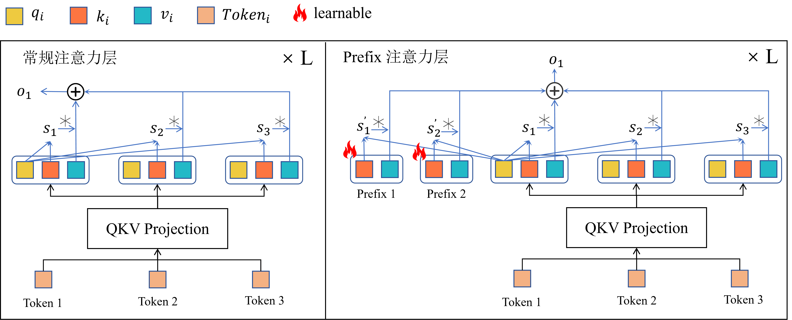
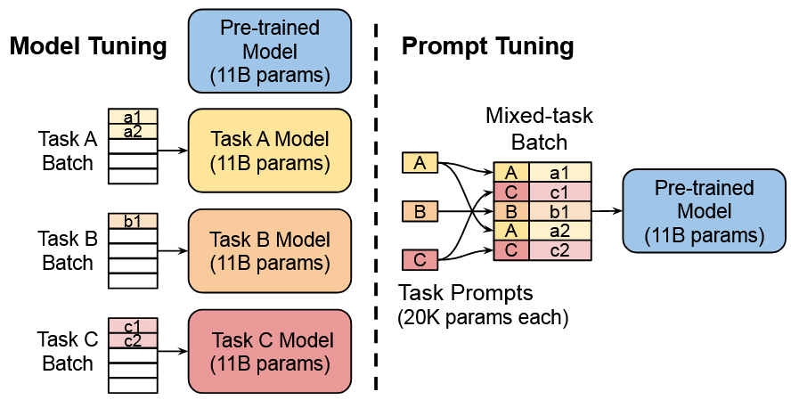
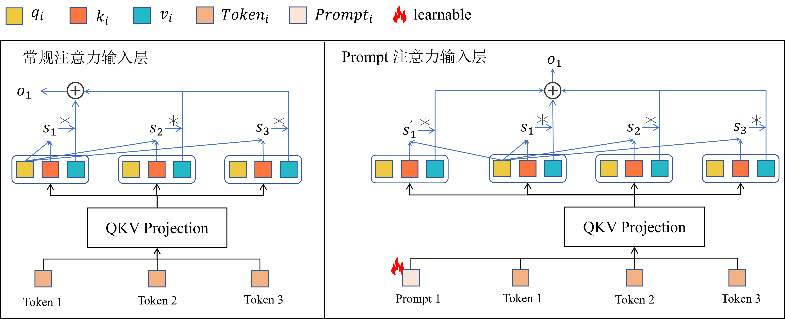
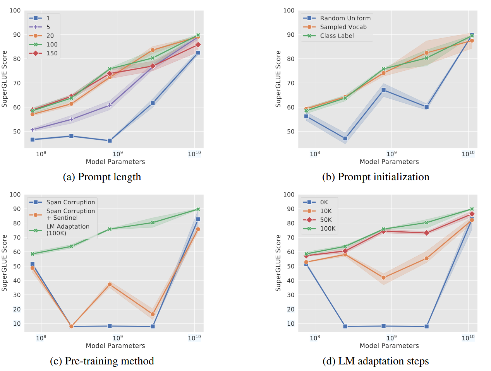
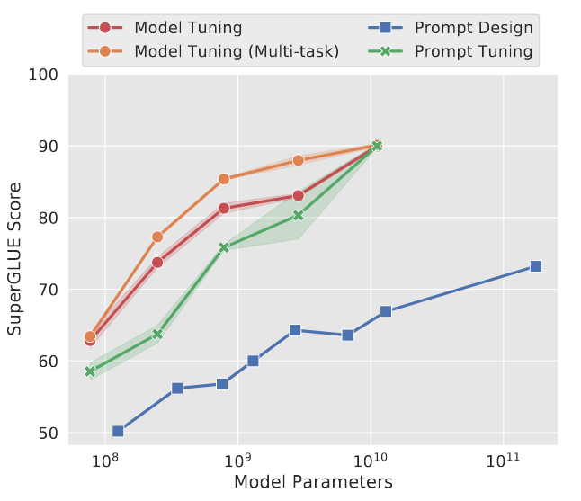
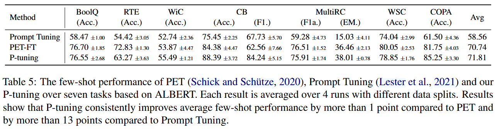
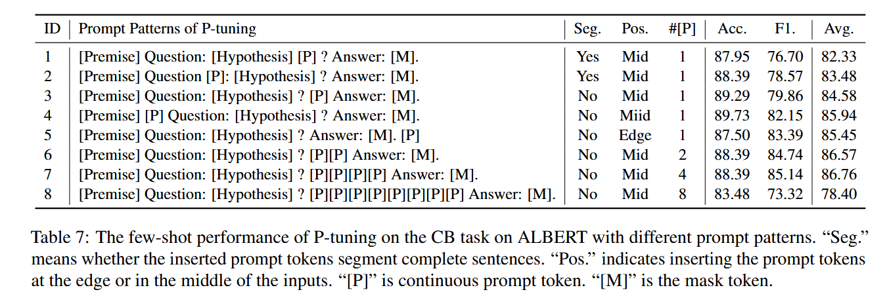
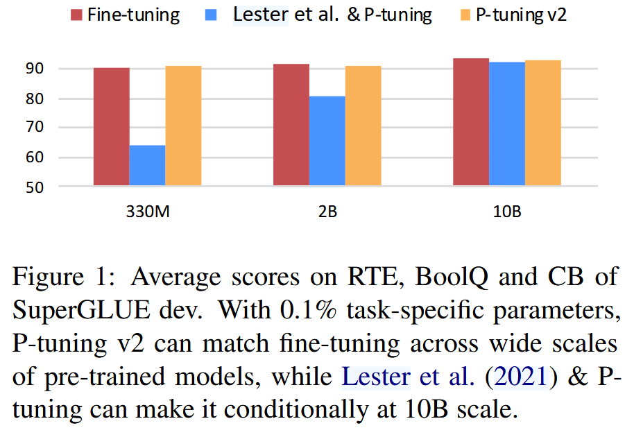
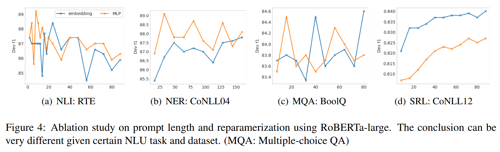

<!--Copyright © ZOMI 适用于[License](https://github.com/Infrasys-AI/AIInfra)版权许可-->

# 02.Prompt-base 微调

>  Author by: 许起星

本章节的内容可以说是**参数高效微调 PEFT**（而非全量微调）的起源，正如 01.Introduction 部分的微调发展历史脉络图所示，我们可以发现 2021 年是 PEFT 的黄金元年，众多著名的 PEFT 技术喷涌而出，例如大名鼎鼎的 LoRA、Prompt-tuning 等。而在本节，我们主要关注 Prompt-base 的 PEFT 技术，并按照历史发展脉络进行展开，即 Prefix-tuning ➡ Prompt-tuning & P-tuning ➡ P-tuning v2，让读者能够从其发展缘由来把握这些方法。

有同学注意到，Adapter 并非属于 Prompt-base 方法，却也在我们本节内容内，这是因为 Adapter 算是 PEFT 的开山之作，而 Prompt-base 方法从某种意义上又可以说是改进 Adapter 而提出的一种新范式方法（为什么新，且听后文讲解），因此，从 Adapter 入手，更能方便文章展开。话不多说，进入正题。

## 1. Adapter

> Houlsby N, Giurgiu A, Jastrzebski S, et al. Parameter-efficient transfer learning for NLP[C]//International conference on machine learning. PMLR, 2019: 2790-2799.

### 背景

Adapter 最初提出的背景是迁移学习，迁移学习是一个广义概念，指“利用在源任务上学到的知识，来帮助目标任务的学习”，而大模型微调是迁移学习的一种具体实现方式。在当时，基于一个经过预训练的大模型，针对每一个下游任务，都需要对这个大模型进行全量微调，这是极其消耗资源的，既消耗计算资源（全量微调需要对大模型的所有参数都进行更新），又消耗存储资源（对于每一个下游任务，都需要保存完整的模型副本）。

为了解决上述问题，Adapter 通过不改变原有预训练大模型参数的基础上，向大模型中插入一些可学习的模块，这些可学习的模块就称为 Adapter。对于每一个下游任务，训练时把原先预训练权重进行冻结，只训练 Adapter 部分即可，这既节省了计算资源（从对所有参数更新变成只对 Adapter 参数更新），又节省了存储资源（对于 N 个下游任务，不再需要保存 N 份完整的模型副本，只需要保存 1 份预训练模型副本和 N 份 Adapter）。而 Adapter 参数量极少，仅占大模型参数量的大约 3.6% 左右，此外，还能达到与全量微调相当的效果。这些 Adapter 还是可拔插式（后续的 PEFT 方式大部分也都是可拔插式的），拿洗澡时的花洒打个比方，如果下游任务是希望细丝状出水，则接上细丝状出水的花洒头即可，如果下游任务是希望喷雾状出水，则接上喷雾状出水的花洒头即可，而整个从自来水厂到接入家中的出水系统（即预训练模型）是保持不变的。


### 模型架构

Adapter 应用于 Transformer 架构中。如下图，左边是结合 Adapter 后的 Transformer Layer 架构图，Adapter 串行接入到两个前馈层（Feed-forward layer）后面；右边是 Adapter 内部的具体实现架构图，每个 Adapter 由下采样线性层（从高维映射到低维）、非线性激活和上采样线性层（从低维映射到高维）构成，重要的是还有一个残差连接，这个**残差连接**是重点，后面要考。


模型架构十分简单，下面给出一个基于 Pytorch 的代码示例（非完整版），可以看到，每个 Adapter 仅含有 2md + d + m 个参数，其中 d 是输入数据的维度，m 是降维的维度，也就是代码中的 bottleneck_dim，其中 m << d。对于下采样线性层，有 md + m 个参数，对于上采样线性层，有 md + d 个参数，因此总共是 2md + d + m 个参数。

```python
import torch
import torch.nn as nn
# 非完整版：未实现恒等映射初始化
class Adapter(nn.Module):
    def __init__(self, hidden_dim: int, bottleneck_dim: int = 64, activation: str = "relu"):
        """
        A standard adapter module.

        Args:
            hidden_dim (int): 输入特征维度（例如 Transformer 的 hidden size）
            bottleneck_dim (int): 中间降维维度，通常是 hidden_dim 的 1/16 ~ 1/64
            activation (str): 激活函数，可选 'relu', 'gelu', 'tanh'
        """
        super().__init__()
        self.down = nn.Linear(hidden_dim, bottleneck_dim) # 下采样线性层
        self.nonlinearity = { # 非线性激活
            "relu": nn.ReLU(),
            "gelu": nn.GELU(),
            "tanh": nn.Tanh(),
        }[activation.lower()]
        self.up = nn.Linear(bottleneck_dim, hidden_dim) # 上采样线性层

    def forward(self, x):
        residual = x
        x = self.down(x)
        x = self.nonlinearity(x)
        x = self.up(x)
        return residual + x  # 残差连接
```

### 实现细节

在实现细节中，最重要的就是初始化时的**恒等映射**（即在第一次更新模型 Adapter 参数之前，让加了 Adapter 模型的输出和原始预训练模型的输出几乎保持一致），这由两方面来共同实现，一方面是**残差连接**，另外一方面是**初始化策略**。

**为什么初始化时要进行恒等映射呢？**若直接采用随机初始化，虽然预训练模型的参数已收敛到较优的语义空间，但新加入的 Adapter 会打破这种空间分布。具体而言，随机初始化的 Adapter 会在每个插入位置引入随机扰动，使原本稳定的特征表示被偏移，相当于在模型中注入噪声。这种噪声会随着网络深度层层传播、放大，导致模型输出分布发生剧烈变化，从而使预训练权重的语义结构被破坏，模型性能骤降。更重要的是，Adapter 通常只包含极少量可训练参数，若模型在初始阶段就偏离了原有的最优空间位置，仅依靠这些少量参数进行纠正几乎不可能，训练过程也会变得不稳定。因此，通过恒等映射初始化，使 Adapter 在刚插入时“几乎等价于未插入”，可保证模型整体仍处于与预训练模型一致的空间起点。这样不仅能避免破坏原有知识分布，还能在一个良好的初始化位置上进行平滑优化，从而实现对预训练模型的稳定接管。

**如何实现初始化时进行恒等映射呢？**它由残差连接和采样层参数初始化为 0 来共同实现，采样层初始化为 0 使得第一次前向传播时，经过采样层的输出是 0（Adapter 结构图中垂直的那条线），残差连接使得第一次前向传播时，输出等同于原先的预训练模型输出（Adapter 结构图中右边那条线）+ 0（Adapter 结构图中垂直的那条线）。因此二者在共同作用下，第一次前向传播的输出完全等同于预训练模型的输出。下面给出了完整版实现了恒等映射初始化的代码。

```python
import torch
import torch.nn as nn
# 完整版：实现恒等映射初始化
class Adapter(nn.Module):
    def __init__(self, hidden_dim: int, bottleneck_dim: int = 64, activation: str = "relu"):
        """
        A standard adapter module.

        Args:
            hidden_dim (int): 输入特征维度（例如 Transformer 的 hidden size）
            bottleneck_dim (int): 中间降维维度，通常是 hidden_dim 的 1/16 ~ 1/64
            activation (str): 激活函数，可选 'relu', 'gelu', 'tanh'
        """
        super().__init__()
        self.down = nn.Linear(hidden_dim, bottleneck_dim)
        self.nonlinearity = {
            "relu": nn.ReLU(),
            "gelu": nn.GELU(),
            "tanh": nn.Tanh(),
        }[activation.lower()]
        self.up = nn.Linear(bottleneck_dim, hidden_dim)

        # 初始化策略：让 adapter 初始时接近恒等映射
        nn.init.xavier_uniform_(self.down.weight)
        nn.init.zeros_(self.down.bias)
        nn.init.zeros_(self.up.weight)
        nn.init.zeros_(self.up.bias)

    def forward(self, x):
        residual = x
        x = self.down(x)
        x = self.nonlinearity(x)
        x = self.up(x)
        return residual + x  # 残差连接

```

**把 LayerNorm 也给顺手训练了**。作者在论文中提到，他们把 LayerNorm 也“顺手”训练了。因为预训练模型的特征分布是针对通用语料或源域任务的，而新任务（尤其是跨领域任务）输入分布不同，若完全冻结 LayerNorm，则无法调整归一化尺度，模型容易“分布不匹配”。此外，由于 LayerNorm 涉及的参数不多，对于大模型参数总量而言几乎只占 0.1% 左右，加上 LayerNorm 训练的话，总体的性能还能再提高一些点，而最近的研究 $^{[2]}$ 也表明了 LayerNorm 在微调中起着重要作用。

### 实验结论

论文的实验部分也验证和揭示了几个重要而有趣的结论。

**第一个是 Adapter 中的超参 m 的影响，即下采样线性层的维度。**这是一个性能和参数效率的权衡，m 越大，性能往往会更好一点（不绝对），可训练参数变得更沉重。但通常都具备稳定性，即不同 m 对最后的性能效果相差不会太大。

**第二个是位于模型不同位置的 Adapter 对模型的影响不同，越靠近输出层的 Adapter 对模型影响越大**。作者将所有 Adapter 在 MNLI 和 CoLA 任务上进行分别训练，然后把训练好的模型中不同部分的 Adapter 进行摘除，查看摘除后对模型性能的影响。如下图这个热力图所示，在这个二维热力图中，第 i,j （i≤j）个元素表示摘除了 i~j 层的 Adapter，输出层是最后一层，如最右上角的元素表示摘除了 0~11 层（即所有层）的 Adapter 后的性能下降程度，颜色越深表示性能下降越多。由下图发现：

- 位于模型不同位置的 Adapter 对模型的影响不同，越靠近输出层的 Adapter 对模型影响越大。
- 单摘除某一层的 Adapter 对模型几乎无影响。
- 把浅层（如 0~2 层）的 Adapter 都摘除了，对性能影响不大。


**第三个是验证恒等映射初始化的影响**。在下图中，同样是在 MNLI 和 CoLA 任务上进行分别训练，横轴表示恒等映射初始化的程度，越往左表示越接近恒等映射初始化，越往右则反之。可以看到，如果不进行恒等映射初始化，很可能会导致模型的性能大打折扣。


**第四个是 Adapter 的多种变体**。作者还尝试了不同架构的 Adapter，比如：

- 在 Adapter 中加入 BatchNorm 或 LayerNorm。
- 对于每一个 Adapter，增加其内部的上下采样层数量。
- 采用不同的激活函数，如 tanh。
- 只在注意力层加 Adapter。
- 并行地（而非本文中串行地）加 Adapter。

发现这些变体的结果和本文提出的架构结果差不多。

## 2. Prefix-tuning

> Li X L, Liang P. Prefix-tuning: Optimizing continuous prompts for generation[J]. arXiv preprint arXiv:2101.00190, 2021.

介绍完 Adapter，接下来介绍一个比它**更轻量级**且能达到同样甚至更好效果（其实不总是能达到更好效果，需要看任务复杂程度）的方法——Prefix-tuning。我们还是首先介绍一下它的方法，然后再介绍它相比于其它方法的优缺点和一些消融相关实验。

### 模型架构

先前介绍的 Adapter 所需要的参数大约占模型参数的 3%，而 Prefix-tuning 只需要大约 0.1% 左右。那么它是怎么做的呢？

下图的上半部分是常规注意力层，对于某一注意力层，假设有 N 个 Token（此处 N=3），每个 Token 都有自己的 $q_i$、$k_i$、$v_i$ 向量，其中 $i$ 是 Token 的索引，对于第 $i$ 个 Token，它需要拿它的 $q_i$ 与其它 Token 的 $k_j (1≤j≤N)$  计算得到对应的分数 $s_j$，再将分数去与对应的 $v_j$ 加权求和，得到该 Token 的输出 $o_i$。

下图的下半部分则是 Prefix-tuning ，在注意力层的 N 个 Token 前面加上 T（此处 T=2） 个可学习的参数 $k_t$ 和  $v_t$（**注意！！！没有** $q_t$**！！！**），称之为 prefix。在第 $i$ 个 Token 计算其输出时，它不仅仅需要拿它的  $q_i$ 与其它 Token 的 $k_j (1≤j≤N)$  计算得到对应的分数 $s_j$，而是还需要考虑这些 prefix，即 $q_i$ 与当前层各个 prefix 以及其它 Token 的 $k_j (1≤j≤T+N)$  计算得到对应的分数 $s_j$，再与对应的 $v_j$ 加权求和得到最终的输出 $o_i$。

注意，如果模型由 $L$ 个注意力层构成，那么在**每层**都会加上**相应独立非共享**的 Prefix。



```python
# 代码来源：https://github.com/huggingface/peft/blob/main/src/peft/tuners/prefix_tuning/model.py
# 本套代码既是 Prefix-tuning，又是 P-tuning v2 的代码。
import torch
class PrefixEncoder(torch.nn.Module):
    def __init__(self, config):
        super().__init__()
        self.prefix_projection = config.prefix_projection
        token_dim = config.token_dim
        num_layers = config.num_layers
        encoder_hidden_size = config.encoder_hidden_size
        num_virtual_tokens = config.num_virtual_tokens
        if self.prefix_projection and not config.inference_mode: # 这里是重参数化部分，下面会讲
            # Use a two-layer MLP to encode the prefix
            # 总参数量：T × dim + dim × en_size + en_size + en_size × N × 2 × dim + N × 2 × dim
            self.embedding = torch.nn.Embedding(num_virtual_tokens, token_dim) # 参数量：T × dim
            self.transform = torch.nn.Sequential(
                torch.nn.Linear(token_dim, encoder_hidden_size), # 参数量：dim × en_size + en_size
                torch.nn.Tanh(),
                torch.nn.Linear(encoder_hidden_size, num_layers * 2 * token_dim), # 参数量：en_size × N × 2 × dim + N × 2 × dim
            )
        else:  # P-tuning v2的分支，见P-tuning v2一节
            # 为 num_layers（即上文提的 L 层），每层生成 num_virtual_tokens 个 k_i 和 v_i
            # 参数量：L × T × 2 × dim
            self.embedding = torch.nn.Embedding(num_virtual_tokens, num_layers * 2 * token_dim)
        
    def forward(self, prefix: torch.Tensor):
        if self.prefix_projection:
            prefix_tokens = self.embedding(prefix)
            past_key_values = self.transform(prefix_tokens)
        else:
            past_key_values = self.embedding(prefix)
        return past_key_values
```

### 实现细节

实现细节有四个，第一个是 Prefix 是放在输入 Token 的前面，而非中间或后面；第二个是对于每一个注意力层，都添加了 Prefix，并且这些 Prefix 之间相互独立不共享；第三个则是对 Prefix 的重参数化；第四个是初始化策略，这点见实验结论部分。

论文中说明，如果直接对 Prefix 进行学习训练，这个 Prefix 对学习率和初始化十分敏感，甚至会使得模型性能下降。因此论文提出了对 Prefix 进行重参数化。结合上面的代码很好理解，重参数化即**不是直接**去学习那个巨大的、包含所有层激活值的前缀矩阵，而是通过学习两个**新的**、**辅助性的**参数，来**间接生成**这个前缀矩阵。在推理阶段，我们可以将已训练好的线性层和嵌入层通过计算进行合并，使得推理时参数数量减少到与重参数化前一致。

总而言之，重参数化是在训练阶段引入额外的训练参数，以更好地优化模型，在推理阶段将参数丢弃，只保留由它们计算生成的最终前缀矩阵。在增加了训练成本但不增加推理成本的情况下使得模型训练更稳定丝滑。至于为什么这能行，还需读者自行去了解重参数化相关知识 $^{[4]}$，此处不多介绍。

### 实验结论

**Prefix-tuning 能够通过更少的参数达到更佳的效果。**但并不总是如此，得看任务的复杂程度，在简单任务上，Prefix-tuning 能通过更少的参数达到更佳的效果，但是随着任务复杂，Adapter 和全量微调则可能会反超。

**当训练数据较少时，Prefix-tuning 可能比完全微调效果要好。**

**泛化能力更强。**由于 Prefix-tuning 对原始模型改变微小，因此在某一特定下游任务训练后，相比于 Adapter 和全量微调也能对其它任务保持较好的泛化能力。

**Prefix 的长度不是越长越好。**对于不同的任务，Prefix 的最佳长度不一样，并非越长越好，太长反而会导致性能下降，后续的 Prompt-tuning、P-tuning 也有类似的结论。

**只在第一层 Prefix 的话效果不好。**如果只在模型的输入层进行 Prefix，性能会大打折扣，因此，在中间的注意力层和后面的注意力层进行 Prefix 是有必要的。
**Prefix 和 Infix 的比较。** Infix 的意思是说在 Token 序列的中间加参数，相比于 Prefix 而言，Infix 的效果不如 Prefix。

**Prefix 的初始化。** Prefix 的初始化也是个技术活，当训练数据较少时，初始化的影响更大。作者探究了三种初始化方式，一种是随机初始化，一种是拿词表中与下游任务不相关的词向量进行初始化，还有一种是拿词表中与下游任务强相关的词向量进行初始化。实验结果表明这三种方式带来的性能是递增的。

## 3. Prompt-tuning & P-tuning

> Lester B, Al-Rfou R, Constant N. The power of scale for parameter-efficient prompt tuning[J]. arXiv preprint arXiv:2104.08691, 2021.
>
> Liu X, Zheng Y, Du Z, et al. GPT understands, too[J]. AI Open, 2024, 5: 208-215.

早在 Lester B $^{[5]}$提出来之前，就有 Prompt-tuning 的概念，不过在那时的 Prompt 是 Hard Prompt，亦称为硬提示，它是由人类设计的、由真实单词组成的自然语言文本，比如`把下面的句子翻译成中文：`作为硬提示输入给大模型。这种硬提示优点是直观，不需要训练任何参数，且具备一定的效果；缺点是不可微，因为它和普通的输入文本没有任何区别，因此它对下游任务的效果十分有限，十分依赖于大模型本身的零样本泛化能力。

于是，Lester B $^{[5]}$ 提出了使用 Soft Prompt 来替代 Hard Prompt，相比于 Hard Prompt，它是一组连续可学习的向量，它可以像训练神经网络权重一样，通过梯度下降来微调这些向量的数值，使其在下游任务中达到最优。在本节中，为了方便叙述我们把 Prompt-tuning 视为 Soft Prompt-tuning。而 P-tuning 和 Prompt-tuning 从架构来看十分相似，因此放在一起来讲。

### Prompt-tuning

#### 模型架构

如下图所示，对于一般的微调（此处指全量微调，Model Tuning 或 Full fine-tuning），每一个下游任务都需要完整存储一份模型的副本，而对于 Prompt-tuning，每一个下游任务只需要存储少量的 Prompt 参数，所有的下游任务共享一个预训练模型副本。



那么 Prompt 究竟是什么呢？我们可以通过看下面这部分代码的“第1部分”，发现 Prompt 的本质就是 Embedding 向量，每个 Prompt 就是一个 `1 × dim` 的向量。有些模型是 Encoder only 或 Decoder only 模型，所以只在 Encoder 或 Decoder 部分添加 Prompt，此时代码中的`config.num_transformer_submodules=1`，而有些模型是 Encoder & Decoder 架构，此时代码中的`config.num_transformer_submodules=2`，简单起见，我们在此处只讨论 Encoder only 或 Decoder only 模型。

```python
# 代码来源：https://github.com/huggingface/peft/blob/main/src/peft/tuners/prompt_tuning/model.py
import math
import torch
from peft.utils.integrations import gather_params_ctx
from .config import PromptTuningInit
class PromptEmbedding(torch.nn.Module):
    def __init__(self, config, word_embeddings):
        super().__init__()
        ## ==============第1部分：Prompt本质==============
        # Prompt总个数 = 单个模块添加的Prompt个数 * 模块的个数
        total_virtual_tokens = config.num_virtual_tokens * config.num_transformer_submodules
        # Prompt：可以看到一个Prompt就是一个1*token_dim的向量，这里共有total_virtual_tokens个Prompt
        self.embedding = torch.nn.Embedding(total_virtual_tokens, config.token_dim)
        ## ==============第2部分：Prompt初始化策略==============
        # 初始化策略 1：词汇表采样
        if config.prompt_tuning_init == PromptTuningInit.SAMPLE_VOCAB and not config.inference_mode:
            # Randomly sample tokens from the tokenizer's vocab
            vocab_size = word_embeddings.num_embeddings
            init_token_ids = torch.randint(0, vocab_size, (total_virtual_tokens,), dtype=torch.long).to(
                word_embeddings.weight.device
            )
            with gather_params_ctx(word_embeddings.parameters()):
                word_embedding_weights = word_embeddings(init_token_ids).detach().clone()
            word_embedding_weights = word_embedding_weights.to(torch.float32)
            self.embedding.weight = torch.nn.Parameter(word_embedding_weights)
		# 初始化策略 2：文本初始化
        elif config.prompt_tuning_init == PromptTuningInit.TEXT and not config.inference_mode:
            from transformers import AutoTokenizer
            tokenizer_kwargs = config.tokenizer_kwargs or {}
            # security: disallow trust_remote_code, as this could allow code execution when loading a prompt tuning
            # checkpoint
            tokenizer_kwargs.pop("trust_remote_code", None)
            tokenizer = AutoTokenizer.from_pretrained(config.tokenizer_name_or_path, **tokenizer_kwargs)
            init_text = config.prompt_tuning_init_text
            init_token_ids = tokenizer(init_text)["input_ids"]
            # Trim or iterate until num_text_tokens matches total_virtual_tokens
            num_text_tokens = len(init_token_ids)
            if num_text_tokens > total_virtual_tokens:
                init_token_ids = init_token_ids[:total_virtual_tokens]
            elif num_text_tokens < total_virtual_tokens:
                num_reps = math.ceil(total_virtual_tokens / num_text_tokens)
                init_token_ids = init_token_ids * num_reps
            init_token_ids = init_token_ids[:total_virtual_tokens]
            init_token_ids = torch.LongTensor(init_token_ids).to(word_embeddings.weight.device)
            with gather_params_ctx(word_embeddings.parameters()):
                word_embedding_weights = word_embeddings(init_token_ids).detach().clone()
            word_embedding_weights = word_embedding_weights.to(torch.float32)
            self.embedding.weight = torch.nn.Parameter(word_embedding_weights)
	## ==============第3部分：返回Prompt==============
    def forward(self, indices):
        # 返回生成的 Prompt
        prompt_embeddings = self.embedding(indices)
        return prompt_embeddings
```

我们已经知道 Prompt 本质是个 Embedding 向量，论文中还指出，Prompt 的初始化策略对微调下游任务影响很大，他们主要探讨了 **3 种不同的初始化策略**（见上面代码的“第2部分”）：

0. 随机初始化
1. 词汇表采样初始化
2. 文本初始化

随机初始化很简单，在代码中，只要不满足那两个条件语句，那便是随机初始化。词汇表初始化，指的是随机从词汇表中挑选 Prompt 数量的词汇，并拿它们对应的连续向量进行初始化。文本初始化是词汇表初始化的一种特殊情况，词汇表初始化指的是从词汇表中随机挑选词汇对应的向量，而文本初始化指的是从词汇表中挑选用户给定文本的词汇对应的向量。上述描述的是代码实现思路，而在论文中，词汇表初始化又被进一步限制为从最常见的前 5000 个词汇中随机采样（代码中是从所有词汇中随机采样）。针对这三种初始化策略，论文给出了相应的实验对其进行分析，后面我们再探讨。

根据上面代码，我们只知道了 Prompt 是什么以及 Prompt 的不同初始化策略，还有一个问题等待我们去解决，那就是 Prompt 到底怎么用，用在何处？下图与 Prefix-tuning 一节中的图十分相似，不同的在于 Prompt-tuning 中：① Prompt 是和 Token 同层级的，② Prompt 且只在输入层添加，且添加在 Token 的前面 ③ Prompt-tuning 不需要重参数化。由于 Prompt 是和 Token 是同层级的，因此每层都有 N 个输入和 N 个输出，其中 N 为 Prompt 个数与 Token 个数之和。而在 Prefix-tuning 中，Prefix 是和 Token 经过 QKV 投影后的向量同层级的，且 Prefix 只有 k 和 v，由于没有 q，因此每一层的输出个数是 M 个，其中 M 是 Token 的个数。



#### 实验结论

Prompt-tuning 进行了一些实验，探讨了一些参数设置对微调性能的影响，如 Prompt 的长度以及初始化。由于 Prompt-tuning 与 Prefix-tuning 提出时所使用的基础模型不同（Prompt Tuning 使用 T5 模型，Prefix-Tuning 使用 GPT-2 和 BART 模型）以及任务领域不同（Prompt-tuning 专注于 SuperGLUE 基准测试，属于 NLU 自然语言理解任务，Prefix-Tuning 则专注于生成任务 NLG），因此没有进行性能上的比较。

在此处，我们只简单讨论一下 Prompt 长度及初始化策略，如下图 a，我们可以发现，**Prompt 长度并非越大越好**，比如 Prompt 长度为 150 时，其效果有时甚至不如长度为 20 时，其次，如图 b，Prompt 的初始化策略对下游任务存在显著影响，Class Label 即我们说的文本初始化，可以发现，随机初始化在模型较小时，效果大打折扣。其余图 c 和 d 不做过多描述，有兴趣的读者自行阅读原文。从这 4 个图中，我们可以得到一个重要的发现，**当模型越来越大时，无论在何种设置下（各种 Prompt 长度或各种初始化策略），模型的性能都变得十分稳定**。



此外，论文还将 Prompt-tuning 与 全量微调和 Hard Prompt-tuning（图中写成是 Prompt Design）进行对比，如下图，实验结果表明，**随着模型增大，Prompt-tuning 逐渐趋于全量微调的性能**，但 Prompt Design 则远低于其余二者。



论文在实验中还提到一点，**Prompt-tuning 的泛化性比全量微调更好**，即让模型在同一个特定领域的下游任务 A 上分别进行 Prompt-tuning 和全量微调，然后在另外一个下游任务 B 上进行评估，目的是测试在特定任务微调之后，模型对原本能力的保持程度还剩多少，结论是 Prompt-tuning 比全量微调的评估性能要高。这是显而易见的，从直觉上来讲，参数改动越少，则原始预训练模型的能力保持越多。

在最后，论文还进行了一个十分有意思的实验，尝试讨论 **Prompt 的可解释性**，即模型学习到的 Prompt 到底有什么含义。作者使用 Prompt-tuning 对下游任务进行微调，然后拿训练后的 Prompt 与词汇表中所有单词向量计算余弦距离 。作者发现，在 BoolQ 数据集（包含大量科学类问题）上训练的 Prompt，其最近邻中高频出现 "science"、"technology"、"engineering"等词，这表明 Prompt 的一个重要作用可能是“启动”模型，让它进入特定的领域模式（例如：“注意，接下来要用科学知识来回答问题”）。在持续学习领域，不少研究者就提出了 Prompt-base 的持续学习方法，为每一个下游任务训练特定的 Prompt，在推理时选择相应的 Prompt 来执行特定的任务。

### P-tuning

#### 模型架构

P-tuning 的模型架构和 Prompt-tuning **相同之处**在于 Prompt 和 Token是同层级的，且只在输入层添加；**不同之处**在于 P-tuning 的 Prompt 并非是最原始的 Embedding 向量，而是有一个 Prompt Encoder（LSTM 或 MLP）， 原先的 Embedding 向量经过这个 Prompt Encoder 后得到的向量才被我们称为 Prompt，进而与 Token 一同输入给模型，因此在 P-tuning 训练时不仅仅需要优化学习 Embedding 向量，还需要学习 Prompt Encoder。此外，P-tuning 不只是在添加在 Token 的前面，它可以插入在 Token 序列的其它位置，论文中的插入方式如下：`T = {[P0:i], x, [P(i+1):j ], y, [P(j+1):k]}`，其中`x`是输入，`y`是对应 NLU 任务中的标签 ，而`P`便是 Prompt。

结合上一段话以及下面的代码，我们便能对 P-tuning 架构一目了然了，由于代码十分简单，且已经注释，因此不赘述。

```python
# 代码来源：https://github.com/huggingface/peft/blob/main/src/peft/tuners/p_tuning/model.py
# Based on https://github.com/NVIDIA/NeMo/blob/main/nemo/collections/nlp/modules/common/prompt_encoder.py
# with some refactor
import warnings
import torch
from .config import PromptEncoderConfig, PromptEncoderReparameterizationType

class PromptEncoder(torch.nn.Module):
    """
    The prompt encoder network that is used to generate the virtual token embeddings for p-tuning.
    """
    def __init__(self, config):
        super().__init__()
        self.token_dim = config.token_dim
        self.input_size = self.token_dim
        self.output_size = self.token_dim
        self.hidden_size = config.encoder_hidden_size
        # total_virtual_tokens即Prompt的个数
        self.total_virtual_tokens = config.num_virtual_tokens * config.num_transformer_submodules
        # encoder_type即Prompt Encoder是LSTM还是MLP
        self.encoder_type = config.encoder_reparameterization_type

        # embedding
        self.embedding = torch.nn.Embedding(self.total_virtual_tokens, self.token_dim) # 原始的Embedding向量
        if not config.inference_mode:
            # Prompt-Encoder:LSTM
            if self.encoder_type == PromptEncoderReparameterizationType.LSTM:
                lstm_dropout = config.encoder_dropout
                num_layers = config.encoder_num_layers
                # LSTM
                self.lstm_head = torch.nn.LSTM(
                    input_size=self.input_size,
                    hidden_size=self.hidden_size,
                    num_layers=num_layers,
                    dropout=lstm_dropout,
                    bidirectional=True,
                    batch_first=True,
                )
                self.mlp_head = torch.nn.Sequential(
                    torch.nn.Linear(self.hidden_size * 2, self.hidden_size * 2),
                    torch.nn.ReLU(),
                    torch.nn.Linear(self.hidden_size * 2, self.output_size),
                )
			# Prompt-Encoder:MLP
            elif self.encoder_type == PromptEncoderReparameterizationType.MLP:
                encoder_num_layers_default = PromptEncoderConfig.encoder_num_layers
                if config.encoder_num_layers != encoder_num_layers_default:
                    warnings.warn(
                        f"for {self.encoder_type.value}, the argument `encoder_num_layers` is ignored. "
                        f"Exactly {encoder_num_layers_default} MLP layers are used."
                    )
                layers = [
                    torch.nn.Linear(self.input_size, self.hidden_size),
                    torch.nn.ReLU(),
                    torch.nn.Linear(self.hidden_size, self.hidden_size),
                    torch.nn.ReLU(),
                    torch.nn.Linear(self.hidden_size, self.output_size),
                ]
                self.mlp_head = torch.nn.Sequential(*layers)
            else:
                raise ValueError("Prompt encoder type not recognized. Please use one of MLP (recommended) or LSTM.")

    def forward(self, indices):
        # 此处只是生成Prompt（“Embedding->Prompt Encoder”=Prompt），没有说明Prompt是如何与Token结合
        input_embeds = self.embedding(indices)
        if self.encoder_type == PromptEncoderReparameterizationType.LSTM:
            output_embeds = self.mlp_head(self.lstm_head(input_embeds)[0])
        elif self.encoder_type == PromptEncoderReparameterizationType.MLP:
            output_embeds = self.mlp_head(input_embeds)
        else:
            raise ValueError("Prompt encoder type not recognized. Please use one of MLP (recommended) or LSTM.")
        return output_embeds
```

#### 实验结论

由于 Prompt-tuning 和 P-tuning 都是选择 NLU 作为基准，P-tuning 选择在极端缺乏数据的情况（few-shot）下与 Prompt-tuning 进行对比，结果如下表所示，在基于 ALBERT 的实验中，P-Tuning 的平均分（71.81）比 Lester 等人提出的 Prompt Tuning (58.56) 高出了 13 个百分点以上 。



作者还进行了一些**消融实验**，主要是这三方面的消融：① Prompt Encoder 的类型 ② Prompt 的位置和数量。



- Prompt Encoder 的类型：对比了 **LSTM**、**MLP** 和 **EMB**（即不使用 Encoder，直接优化 Embedding），结果表明 LSTM 和 MLP 表现稳健，而 EMB 在某些任务（如 WiC 和 CB）上表现不稳定且性能大幅下降 。这证明了对连续提示词之间相互依赖性建模的必要性 。
- Prompt 的位置和数量：如上图中的表 7 所示，可以看到 Prompt 插入是否割裂完整句子、插入的位置以及个数都对结果有着不同的影响，一般而言，作者不建议 Prompt 的插入割裂完整句子，且 Prompt 的个数也并非越多越好，过多的 Prompt 可能因为训练数据有限而难以优化 ，还是需要根据具体任务而调参。

## 4. P-tuning v2

根据 Prompt-tuning 和 P-tuning 的实验发现**，当模型不够大时这两种方法效果相比于全量微调而言差得较多**，如下图的蓝色部分，而 P-tuning v2 则能在各种中等尺寸的模型上同样能达到较好的效果。此外，**Prompt-tuning 和 P-tuning 不具备跨任务的通用性**，先前的实验都是在 NLU 任务上进行的，当遇到其他类型的任务（如序列标注任务）时，则这两种方法效果也大打折扣。



当看到标题是 P-tuning v2 时，我们容易将其与 P-tuning v1 进行对比，但实际上它更像是 Prefix-tuning 的进化版。它的架构和 Prefix-tuning 几乎完全一样，同样是在各个 Transformer 层中的 N 个 Token 前加上若干个可学习的参数 $k_t$ 和  $v_t$（**注意！！！没有** $q_t$**！！！**），称之为 prefix。**但与 Prefix-tuning 不同的是，它并不总是采用重参数化**。因为作者发现，对于 NLU 任务，重参数化并不总是有效，当模型较小的时候，增加这些层会对效果产生不好的影响，见下图 4，在 RTE 和 CoNLL04 数据集中，重参数化大部分时候都比非重参数化要好，但是在另外两个数据集中，结果则相反，此外，通过图 4 也可以看出 Prompt 的长度也并非越高越好。因此在 Prefix-tuning 中的代码部分，可以看到有另外一个分支是不走重参数化的。



**此外，为了提高模型跨任务的通用性，P-tuning v2 抛弃 Verbalizer 而选择采用 CLS Token**。所谓的 Verbalizer 其实是一个映射表，而不是一个神经网络层。在传统的 Prompt Tuning 中，我们将分类任务转化为“完形填空”。如果输入句子是“这部电影太赞了！”，那么我们在训练模型时会这样构造输入“这部电影太赞了！总的来说，它是 [MASK] 的”，接着模型会在 `[MASK]` 位置预测一个词。如果模型预测 `[MASK]` 是 “好”，Verbalizer 将其映射为标签“正面”，否则是“负面”。总而言之，Verbalizer 就是一个映射表。模型只负责说出某个“词”，而你根据这个映射表把这个词翻译成最终的业务分类。因为 Verbalizer 很难设计，对于简单的分类（好/坏）还行，但如果有 100 个类别，或者做“序列标注”（给每个字打标签），我们根本找不到 100 个合适的词来做映射。而 [CLS] Token 是 BERT 等 Transformer 编码器中的一个特殊占位符，它通常放在输入序列的第一个位置， 在自注意力机制中，[CLS] 这个位置的向量会去观察句子中所有的其他 Token，经过多层计算后，[CLS] 对应的输出向量被认为**包含了整个句子的语义信息**。因此，我们在训练时，会取出最后一层 Transformer 层的 [CLS] 向量，然后输入给一个线性分类器，最终根据线性分类器直接输出分类结果。

## 5. Prompt-base 适用范围

## 6. 参考与引用

[1] Houlsby N, Giurgiu A, Jastrzebski S, et al. Parameter-efficient transfer learning for NLP[C]//International conference on machine learning. PMLR, 2019: 2790-2799.

[2] ValizadehAslani T, Liang H. LayerNorm: A key component in parameter-efficient fine-tuning[J]. arXiv preprint arXiv:2403.20284, 2024.

[3] Li X L, Liang P. Prefix-tuning: Optimizing continuous prompts for generation[J]. arXiv preprint arXiv:2101.00190, 2021.

[4] https://zhuanlan.zhihu.com/p/361090497

[5] Lester B, Al-Rfou R, Constant N. The power of scale for parameter-efficient prompt tuning[J]. arXiv preprint arXiv:2104.08691, 2021.

[6] Liu X, Zheng Y, Du Z, et al. GPT understands, too[J]. AI Open, 2024, 5: 208-215.