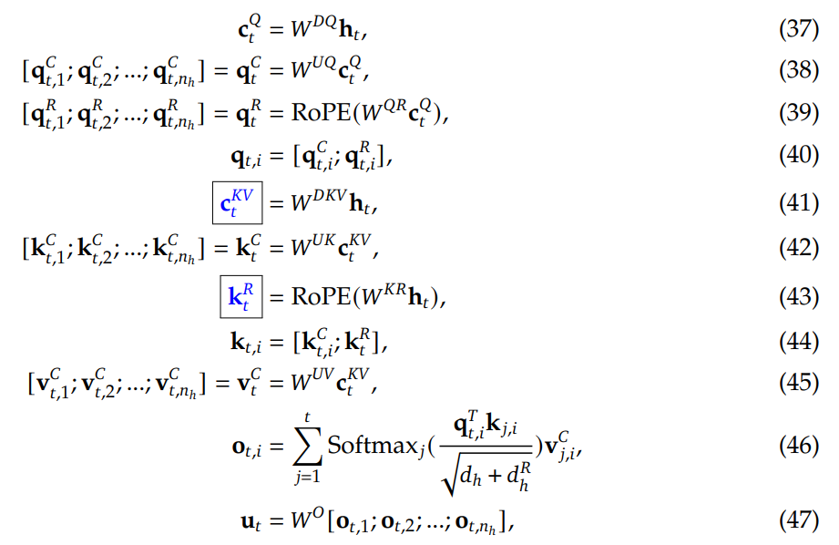
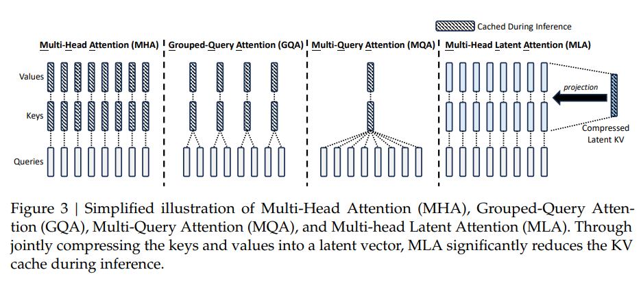

# MLA(multi-head latent attention)原理解读

DeepSeekV2技术报告中提出了一种新的attention计算方法，叫做multi-head latent attention，简称MLA，可以减少KV Cache缓存。

## 计算公式详解

首先我们来看一下传统的multi-head attention（MHA）计算所需要缓存的KV Cache大小。假设q、k、v的注意力头的数量为$n_h$，每个头的维度为$d_h$，那么在进行增量计算的时候，q、k、v的shape为($n_h$, 1, $d_h$)，所以单个token需要缓存的kv的数据量为2$n_hd_h$。

那么MLA是怎么做的呢？它的思想是把kv的维度通过矩阵映射降低，再进行缓存，使用的时候再使用矩阵映射把维度还原。接下来具体看一下每一步的计算公式。

### q的计算

首先是计算q。假设第t个token的embedding向量是$h_t$，其维度是$n_hd_h=H$，传统的MHA是直接使用$W_q*h_t$得到q。而MLA是先把$h_t$映射到一个低秩空间（其实就是降维），然后再进行升维。

降维：$C^Q_t=W^{DQ}h_t$，D可以理解为`down`。$W^{DQ}$的形状为[$d_q$, $H$]，所以$C^Q_t$的维度为$d_q$，在deepseek技术报告中$d_q$取12$d_h$。

升维：$q^C_t=W^{UQ}*C^Q_t$，U可以理解为`up`。$W^{UQ}$的形状为[$n_hd_h$, $d_q$]，所以$q^C_t$的维度为$n_hd_h$，恢复到原来的维度了，记为$q^C_t=[q^C_{t,1}, q^C_{t,2},..., q^C_{t,n_h}]$。

由于q和k需要做位置编码，MLA没有直接对$q^C_t$进行位置编码，而是用另一个矩阵对$C^Q_t$进行升维后，再进行位置编码：$q^R_t=Rope(W^{QR}*C^Q_t)$，R可以理解为`Rotary position embedding`。$W^{QR}$的形状为[$n_hd_h/2$, $d_q$]，所以$q^R_t$的维度是$n_hd_h/2$，$q^R_t=[q^R_{t,1}, q^R_{t,2},..., q^R_{t,n_h}]$，每个分量$q^R_{t,i}$的维度是$d_h/2$。

最后，把$q^C_t$和$q^R_t$合并，作为最终的q，它的第i个注意力头为$[q^C_{t,i}; q^R_{t,i}]$。

### k和v的计算

然后是k、v的计算。

第一步也是降维：$C^{KV}_t=W^{DKV}h_t$，$W^{DKV}$的形状为[$d_c$, $H$]，所以$C^{KV}_t$的维度为$d_c$，在deepseek技术报告中取$d_c=4d_h$。

然后参考q的计算过程来计算k。

首先计算不带位置编码的部分：$k^C_t=W^{UK}*C^{KV}_t$，$W^{UK}$的形状为[$n_hd_h$, $d_c$]，所以$k^C_t$的维度为$n_hd_h$。

然后计算带位置编码的部分：$k^R_t=Rope(W^{KR}*h_t)$，$W^{KR}$的形状为[$d_h/2$, $n_hd_h$]，所以$k^C_t$的维度为$d_h/2$。

最后，把$k^C_t$和$k^R_t$合并，作为最终的k，它的第i个注意力头为$[k^C_{t,i}; k^R_t]$。

好，到这里暂停一下，我们看一下如果要缓存第t个token的key的信息，需要缓存什么？由于k是$k^C_t$和$k^R_t$这2部分组成的，所以我们要缓存他们，但由于$k^C_t$的维度是$n_hd_h$，太大了，而且$n_hd_h$是$W^{UK}*C^{KV}_t$得到的，$W^{UK}$又是一个常量，所以我们只需要缓存$C^{KV}_t$就够了。总结下来，我们只需要缓存$C^{KV}_t$和$k^R_t$，数据量一共是$4d_h+d_h/2=4.5d_h$。

那么q*k怎么计算呢？第i个注意力头的计算公式如下：

$q^T_i*k_i=(q^C_{t,i})^T*k^C_{t,i}+(q^R_{t,i})^T*k^R_t$

最后看一下v的计算方法：

$v^C_t=W^{UV}*C^{KV}_t$，$W^{UV}$的形状为[$n_hd_h$, $d_c$]，所以$v^C_t$的维度为$n_hd_h$。

由于$W^{UV}$是一个常量，所以我们只需要缓存$C^{KV}_t$就够了。

最后来看一下完整的计算过程：

## 显存和计算量分析

仔细阅读“k和v的计算”这部分，可以得出结论，MLA算法要缓存的KV Cache为$C^{KV}_t$和$k^R_t$，他们的数据量为$4.5d_h$，而原始的MHA要缓存的kv Cache数据量为$n_hd_h$。$n_h$一般取128，所以MLA需要缓存的kvCache远小于MHA。尽管`Grouped-query attention`和`Multi-query attention`也能减少kvCache，但他们需要多个query对应同一组kv，而MLA可以和MHA一样，每个query都对应不同的kv，充分发挥模型的表达能力。

除了kvcache缓存的降低，计算q、k、v的权重矩阵参数量也变小了。主要原因是在计算q、k、v的时候，先进行了降维，再进行升维，包括H->$d_q$->H和H->$d_c$->H。这样的话，权重的参数量就从原来的$H^2$变成了$2H*(d_c+d_q)$，采用了LORA算法的原理。

最后再来看一下计算量可以做哪些优化。

首先是$(q^C_{t,i})^T*k^C_{t,i}$的计算，我们把他们的计算公式代入，得到$(W^{UQ}_i*C^Q_t)^T*W^{UK}_i*C^{KV}_t=(C^Q_t)^T(W^{UQ}_i)^T*W^{UK}_i*C^{KV}_t$，所以可以提前计算好$(W^{UQ}_i)^T*W^{UK}_i$，并且在计算q的时候用上。同理，对于v的计算：$v^C_t=W^{UV}*C^{KV}_t$，可以把$W^{UV}$提前和$W_O$相乘。DeepSeek技术报告中把这种矩阵合并的操作叫做“吸收”。

## 总结

MLA算法主要采用了以下2个优化点：

1，求解q、k、v采用了LORA的思想，降低了权重矩阵的参数量和kvcache的缓存大小；

2，把常量矩阵的计算提前进行，降低运行时的计算量。
